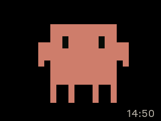
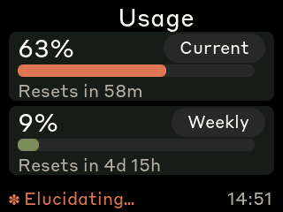
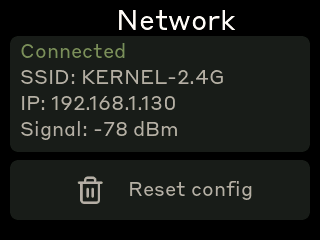
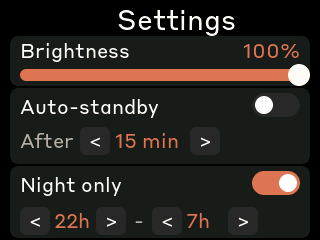
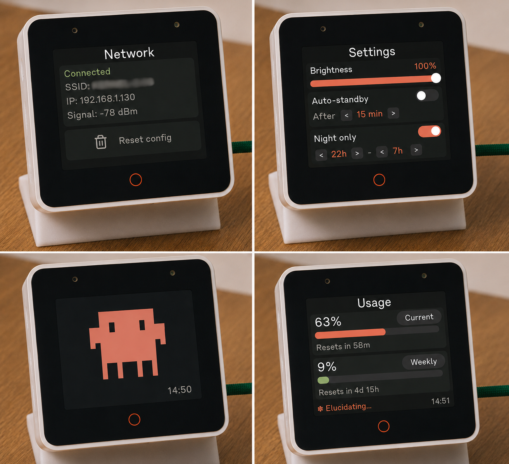

# clawdbox

A desk-side Claude Code usage monitor running on an **Espressif ESP32-S3-BOX**.

Connects to WiFi and polls the Anthropic API directly — no host daemon, no companion app. OAuth tokens are obtained and refreshed on-device via a QR-code pairing flow.

The splash screen plays pixel-art Clawd animations sourced from [claudepix](https://claudepix.vercel.app). Animation intensity tracks your live usage rate.

---

## Screenshots

| Splash | Usage | Network | Settings |
|--------|-------|---------|----------|
|  |  |  |  |

---

## Photos



---

## Screens

| Screen | Description |
|--------|-------------|
| **Splash** | Boot screen with Clawd pixel-art animation, UTC clock, usage rate ticker |
| **Usage** | 5h session % and 7d weekly % with progress bars, reset timers, live clock |
| **Network** | WiFi state, IP address, OAuth status, Reset config zone |
| **Settings** | Brightness, auto-standby, night mode schedule, timezone offset |

Press **BOOT** to cycle screens. Tap anywhere on the splash to hide/show it. Long-press BOOT (>5 s) to factory reset.

---

## Hardware

- **Espressif ESP32-S3-BOX** — 320×240 IPS (ILI9342C), TT21100 capacitive touch, USB-C
- USB-C cable for flashing

## Prerequisites

- [PlatformIO CLI](https://docs.platformio.org/en/latest/core/installation/index.html)
- Active Claude Code / Anthropic subscription (OAuth tokens obtained via on-device QR flow)

---

## Flash

```bash
pio run -d firmware -e s3box -t upload --upload-port /dev/ttyACM0
```

---

## First-boot setup

1. Fresh flash → device starts AP **`Clawdmeter-setup`** (open, no password).
2. Connect to the AP; captive portal opens at `http://192.168.4.1/`.
3. Enter SSID and WiFi password. Submit.
4. Device reboots into STA mode and displays a **QR code** on screen.
5. Scan the QR with a phone browser → Anthropic OAuth login page opens.
6. Authorise. Tokens are pushed back to the device automatically.
7. From now on the device refreshes tokens autonomously (~every 15 min).

---

## Settings (Network screen)

| Setting | Description |
|---------|-------------|
| **Backlight** | PWM brightness slider |
| **Auto-standby** | Dim display after configurable idle timeout |
| **Night mode** | Scheduled low-brightness window |
| **Timezone** | UTC offset (±h); auto-detected from IP on first WiFi connect via ip-api.com |

---

## Why WiFi, not Bluetooth

The obvious alternative — BLE HID or a custom BLE characteristic paired to the host — has a fundamental flaw: it requires the host to be awake, unlocked, and running a companion daemon to push data. The moment you lock your screen, close the lid, or switch machines, the link breaks and the monitor goes stale.

WiFi with direct API polling sidesteps all of that:

| | WiFi (this device) | Bluetooth / USB HID |
|---|---|---|
| **Host dependency** | None — polls Anthropic directly | Requires companion app on every host |
| **Works when host sleeps** | Yes | No |
| **Multi-machine** | Yes — follows your account, not your laptop | No — tied to the paired host |
| **Rate-limit data source** | Official API response headers | Would need IPC from Claude Code CLI |
| **Token refresh** | On-device, autonomous | Host must relay credentials |
| **Setup friction** | One-time portal + OAuth | Pair per machine, install daemon |

The trade-off is that WiFi requires network access and exposes OAuth tokens on the device. See the [Security note](#security-note) below.

---

## How it works

1. Connects to WiFi; NTP syncs the clock.
2. Timezone auto-detected via `http://ip-api.com/json` on first connect; saved to NVS.
3. Every 60 s: POST 1-token probe to `https://api.anthropic.com/v1/messages`, read rate-limit headers (`anthropic-ratelimit-unified-5h-utilization`, `-5h-reset`, `-7d-utilization`, `-7d-reset`).
4. OAuth token nearing expiry → POST to `https://console.anthropic.com/v1/oauth/token` with refresh token; rotated pair persisted to NVS.
5. Splash animation group selected by current usage-rate (usage % change over sliding window).

---

## Physical buttons

| Button | GPIO | Function |
|--------|------|----------|
| **BOOT** | 0 | Cycle screens; long-press >5 s → factory reset |
| **Mute slider** | 1 | Manual poll trigger |

---

## Security note

OAuth tokens are stored in NVS in plaintext. Anyone with USB access can extract them with `esptool.py read_flash`. Before lending, gifting, or recycling the device: long-press BOOT >5 s (or tap **Reset config** on the Network screen) and revoke the token at <https://console.anthropic.com>.

---

## Recompiling fonts

Fonts are pre-compiled LVGL 9 bitmap files in `firmware/src/font_*.c`. To regenerate:

```bash
npm install -g lv_font_conv

for size in 28 20; do
  lv_font_conv --font assets/StyreneB-Regular.otf -r 0x20-0x7E \
    --size $size --format lvgl --bpp 4 --no-compress \
    -o firmware/src/font_styrene_${size}.c --lv-include "lvgl.h"
done
```

Each generated file needs LVGL 9 patching: remove `#if LVGL_VERSION_MAJOR >= 8` guards, drop `.cache`, add `.release_glyph`, `.kerning`, `.static_bitmap`, `.fallback`, `.user_data`.

## Splash animations

```bash
node tools/scrape_claudepix.js   # fetch sprites → tools/claudepix_data/*.json
node tools/convert_to_c.js       # → firmware/src/splash_animations.h
```

## Converting icons

```bash
node tools/png_to_lvgl.js <input.png> <symbol> [W_MACRO] [H_MACRO] [--tint=RRGGBB | --no-tint]
```

Default tint is white. Pass `--no-tint` for pre-coloured artwork.

---

## Disclaimer

This is an independent community project. It is **not affiliated with, endorsed by, or sponsored by Anthropic**.

Claude™ is a trademark of Anthropic, PBC. The name "Claude" and related marks are used solely to describe compatibility and interoperability with Anthropic's API. No claim of affiliation or ownership is made.

The pixel-art animations bundled in this firmware are fan-made artwork sourced from [claudepix.vercel.app](https://claudepix.vercel.app) and are not official Anthropic assets. If you are Anthropic and have concerns about any content in this repository, please open an issue.

This software is provided under the [MIT License](LICENSE) with no warranty of any kind.

---

## Credits

- Inspired by [Clawdmeter](https://github.com/HermannBjorgvin/Clawdmeter) by [@HermannBjorgvin](https://github.com/HermannBjorgvin).
- Pixel-art Clawd animations by [@amaanbuilds](https://x.com/amaanbuilds) via [claudepix.vercel.app](https://claudepix.vercel.app).
- Lucide icon set ([lucide.dev](https://lucide.dev), MIT).
